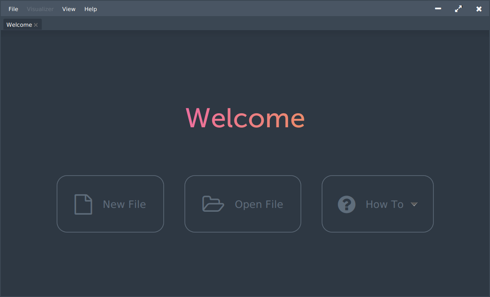

# BrainfuckIDE

## Table of Contents

- [BrainfuckIDE](#brainfuckide)
  - [Table of Contents](#table-of-contents)
  - [About](#about)
  - [Assignment Requirements](#assignment-requirements)
        - [Object Oriented Concepts](#object-oriented-concepts)
        - [Code Elements](#code-elements)
        - [MVC](#mvc)
        - [Multiple Scenes](#multiple-scenes)
        - [About](#about-1)
        - [Data](#data)
  - [Screenshots](#screenshots)
  - [Brainfuck Intro](#brainfuck-intro)

## About

This application is an IDE for the programming language Brainfuck. It provides a built-in interpreter for .bf scripts, a visualizer for program execution, and an ASCII table reference (Ctrl+Shift+Z or `Help > About`).

## Assignment Requirements

##### Object Oriented Concepts

| Concept | Examples |
|:--------|:-----------|
| Classes | `BfLogger`, `BfSpinner`, `Cell`, `Cursor`, `DragOffset`, `EditorTabContent`, `Frame`, `IDE`, `Interpreter`, `PropertiesState`, `ResizeOffset`, `Splash`, `StageResizerBuilder`, `Tape`, `Util`, `Visualizer`, `WindowControlBuilder` |
| Subclasses | `AsciiGridPane`, `AsciiPopup`, `BfLoggerFormatter`, `CellView`, `EditorTab`, `EditorTabReadonly`, `InterpreterModel`, `MismatchedBracketException`, `NwewnhBfIDE`, `PulseAnimation`, `StageControlBuilder`, `WelcomeTab`, `WelcomeTabContent` |
| Abstract Classes | `BfTab`, `MVCModel` |
| Interfaces | `AsciiTable`, `Constants`, `MaximizeController`, `Target` |

##### Code Elements

Collections:

| File & Line Number | Type | Description |
|:-------------------|:-----|:------------|
| `src/bfide/interpreter/Tape.java:15` | `LinkedList<ArrayList<Cell>>` | `Tape` is a custom wrapper for a linked list of descrete arrays which are segments of the "infinite" brainfuck tape for memory efficiency. |
| `src/bfide/interpreter/Interpreter.java:39` | `HashMap<Integer,Integer>` | This collection, called `bracemap`, maps the index of every beginning of a loop to its end and every end of a loop to its beginning. For example, the program `+[+]` produces a `bracemap` of `{1:3, 3:1}`. This is useful so that the program can easily jump from the beginning of a loop to the end and vice versa. |

Exception Handling:

| File & Line Number(s) | Description |
|:-------------------|:------------|
| `src/bfide/IDE.java:726` | Not all systems will support opening a URL in the default browser programmatically. This piece of code will display an alert if the system does not support `Desktop` actions or if opening the URL fails. |
| `src/bfide/ide/tabs/editor/EditorTab.java:148,156,189` | These pieces of code handle file IO, and will all display an `Alert` if an exception occurs while opening, reading from, or writing to a file. |

##### MVC

The following directory tree highlights the MVC structure of this application:

    src/bfide/
    ├── splash/
    │   ├── Splash.FXML  [V]
    │   └── Splash.java  [C]
    └── ide/
        ├── IDE.fxml  [v]
        ├── IDE.java  [C]
        └── tabs/
            ├── editor/
            │   ├── EditorTabContent.fxml  [V]
            │   ├── EditorTabContent.java  [C]
            │   ├── InterpreterModel.java  [M]
            │   ├── spinner/
            │   │   ├── BfSpinner.fxml  [V]
            │   │   └── BfSpinner.java  [C]
            │   └── visualizer/
            │       ├── CellView.fxml    [V]
            │       ├── CellView.java    [C]
            │       ├── Visualizer.fxml  [V]
            │       └── Visualizer.java  [C]
            └── welcome/
                ├── WelcomeTabContent.fxml  [V]
                └── WelcomeTabContent.java  [C]

The IDE is broken down into multiple sub and sub-sub controllers with their own sub and sub-sub views. The IDE contains a `TabPane` for the various kinds of tabs that the editor supports. One of these tabs is the `WelcomeTab`. The other main kind of tab is the `EditorTab`, which itself is composed the `Visualizer` and the `BfSpinner`. The `EditorTab` also makes use of the primary model of this application, `InterpreterModel`.

##### Multiple Scenes

This application has two scenes: the splash screen (`src/bfide/splash`) and the IDE (`src/bfide/ide`). The splash screen displays a loading animation then switches to the IDE via a fade transition.

##### About

This README can be accessed from the application under the menu `Help > About`.

##### Data

This application is, at the end of the day, a text editor. It can Open and Save files, as well as Save As to copy and rename a file. This logic can be found in `src/bfide/ide/tabs/editor/EditorTab.java`; methods `openFile()`, `openResource()`, `save()`, `saveAs()`, `writeToFile()`; lines `138-206`

## Screenshots

Welcome Tab:

Editor Tab:

ASCII Reference:

## Brainfuck Intro

Brainfuck is an esoteric and turing complete language created by Urban Müller in 1993. It consists of eight simple instructions  and a code pointer. The memory is represented as a tape of integer cells whose values can be incremented, decremented, set by user input, and printed to the console.

The instructions are as follows:

| Instruction | Description |
|:-----------:|:------------|
| > | Increment the code pointer (move right) |
| < | Decrement the code pointer (move left) |
| + | Increment the current cell |
| - | Decrement the current cell |
| , | Store a character from user input in the current cell |
| . | Print the current cell's ASCII value |
| [ | Denotes the beginning of a loop |
| ] | Denotes the end of a loop |

Program execution starts with all cells initialized to 0 and the cursor (or code pointer) on the first cell. The move, increment, and decrement instructions (`>`, `<`, `+`, and `-`) all behave as expected -- moving the cursor along the tape or changing the value of the cell that the cursor points to. Input/output is achieved with the read (`,`) and print (`.`) instructions, acting on the current cell much like the increment and decrement instructions.

Brainfuck also provides a looping mechanism where the body of the loop is surrounded by an opening (`[`) and closing (`]`) square bracket. When the program reaches an open-loop instruction (`[`) it checks the current cell value to determine if the body should be executed. If the value is zero it skips to the matching close-loop instruction (`]`) and continues execution. Otherwise, the value is non-zero, and the body of the loop is executed. When the program reaches the end of the loop it jumps back to the beginning of the loop and compares the current cell value to 0 again for another potential iteration.

A full description of Brainfuck and a few example programs can be found on [Wikipedia](https://en.wikipedia.org/wiki/Brainfuck).
